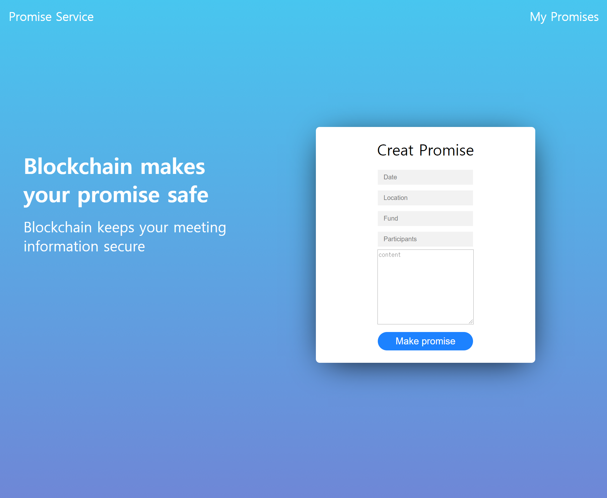
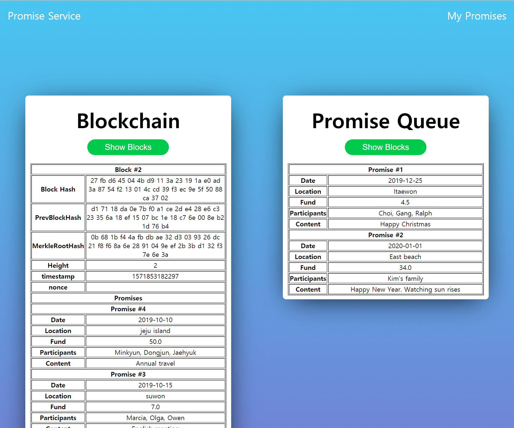
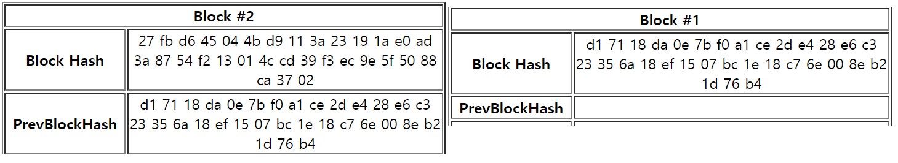

# Gathering(promise, appointment) Recording System using Blockchain
## - 블록체인을 이용한 모임(약속) 정보 기록 시스템

## About The Project
일상 생활에서 친구들과 갖게 되는 모임, 약속 정보를 블록체인의 기본 개념을 이용해 저장할 수 있는 프로젝트이다.   
   
데이터의 위/변조 불가한 블록체인의 중요한 특성을 가진다.    
   
모임에서 사용된 공금 등의 중요한 정보는 누군가에 의해 위/변조 되면 안되는 중요한 정보이므로 블록체인을 이용해 해당 문제를 해결해 보고자 한다.

메인 홈페이지이다. 날짜, 장소, 회비, 참가자, 모임 내용을 입력해 전송한다.   

입력된 모임들을 보여준다. 각 모임은 하나의 트랜잭션으로 여겨진다. 4개의 모임을 모아 하나의 블록으로 구성한다.   
블록은 블록의 해시, 이전블록의 해시, 모임들의 머클루트 그리고 블록에 포함되는 모임 내용들로 이루어진다.

첫번째 블록과 두번째 블록을 살펴보면 첫번째 블록의 해시 값이 두번째 블록의 이전 블록 해시 값으로 들어가 있음을 볼 수 있다. 블록 해싱을 통해 블록끼리 체인을 형성하는 블록체인의 중요한 개념을 학습할 수 있다.

## Prerequisites

Java 8   
Spring3 - mvc   
Apache Tomcat v9.0   
H2 database v1.4.199   
Eclipse   
Spring Tools Suite(STS)   
Maven   
Lombok   

## Release

##### v1.0.0
You can insert gathering information with date, location, funds, participants, content.   
And You can confirm gathering information on Blockchain.

## etc

비트코인의 특징을 공부하고 기본적인 로직을 직접 구현 해보기 위한 프로젝트입니다.   
그렇기 때문에 비트코인 또는 하이퍼 레져 등 오픈소스를 사용하지 않았습니다.   
비트코인 블록과 블록헤더의 구조를 최대한 사용하며 프로젝트 특성에 맞게 수정하였습니다.   
머클트리, 해싱 등을 이용해 블록들을 연결시켜 체인을 직접 구현했습니다.   
블록체인 네트워크는 구성하지 않아 합의 과정은 구현되지 않았습니다.   